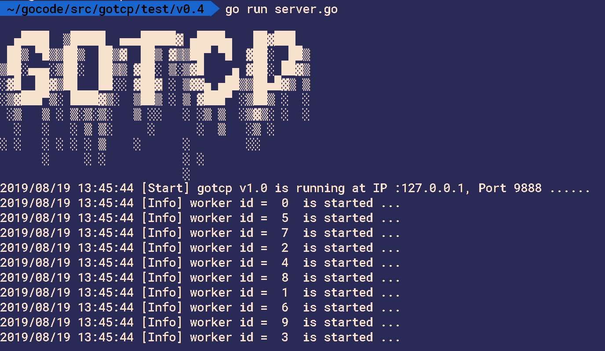

<p align="center">

<br>
</p>

`gotcp` 是采用golang,以面向接口方式开发的,轻量级的,TCP框架.


## Features

- Golang开发-并发处理请求
- 面向接口-灵活扩展
- Request封装-消息数据与请求的包装
- Message封装-粘包问题处理
- Router封装-多路由模式,灵活注册路由来处理不同消息
- 读写分离
- 消息队列及多任务处理(work pool)
- 链接管理-在创建后与销毁之前灵活处理

## Getting Started

### Installing

```sh
$ go get github.com/pzhen/gotcp
```

### Usage

项目中配置配置文件

conf/gotcp.json
```json
{
  "Name": "MyTcpServer",
  "Host": "127.0.0.1",
  "Port": 9888,
  "MaxConn": 1,
  "MaxPkgSize": 512,
  "IPVersion":"tcp4",
  "WorkPoolSize":10
 }
```

server.go
```go
package main

import (
	"fmt"
	"gotcp/Gotcp"
	"gotcp/Igotcp"
)

type MyRouter1 struct {
	Gotcp.BaseRouter
}

func (m *MyRouter1)BeforeHandle(r Igotcp.IRequest)  {
    //Code ...
}

func (m *MyRouter1) Handle(r Igotcp.IRequest) {
	if err := r.GetConnector().Send(1, []byte("11111 handle ..........")); err != nil {
		fmt.Println(err)
	}
}

func (m *MyRouter1)AfterHandle(r Igotcp.IRequest)  {
    //Code ...
}


type MyRouter2 struct {
	Gotcp.BaseRouter
}

func (m *MyRouter2)BeforeHandle(r Igotcp.IRequest)  {
    //Code ...
}

func (m *MyRouter2) Handle(r Igotcp.IRequest) {
	if err := r.GetConnector().Send(1, []byte("22222 handle .........")); err != nil {
		fmt.Println(err)
	}
}

func (m *MyRouter2)AfterHandle(r Igotcp.IRequest)  {
    //Code ...
}


//链接创建时hook
func doBefore(connector Igotcp.IConnector)  {
	fmt.Println("=============>doBefore")
	connector.Send(1, []byte("doBefore"))
}

//链接销毁前hook
func doAfter(connector Igotcp.IConnector)  {
	fmt.Println("=============>doAfter")
	connector.Send(2, []byte("doAfter"))
}

func main() {
	
	//初始化服务
	srv := Gotcp.InitServer()
	
	//注册路由规则
	srv.AddRouter(1, &MyRouter1{})
	srv.AddRouter(2, &MyRouter2{})

    //注册hook
	srv.SetOnConnStart(doBefore)
	srv.SetOnConnStop(doAfter)
	
	//启动服务
	srv.Run()
}
```



## License

